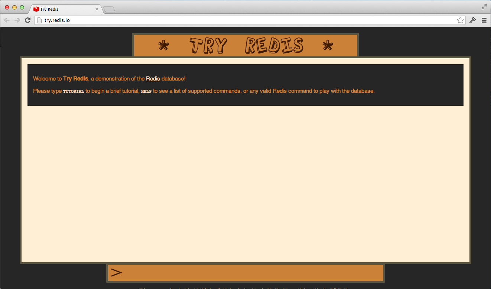
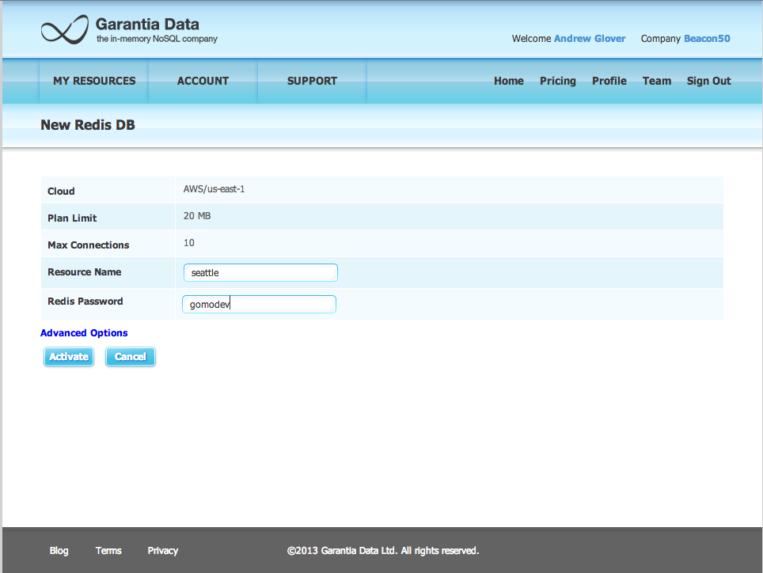
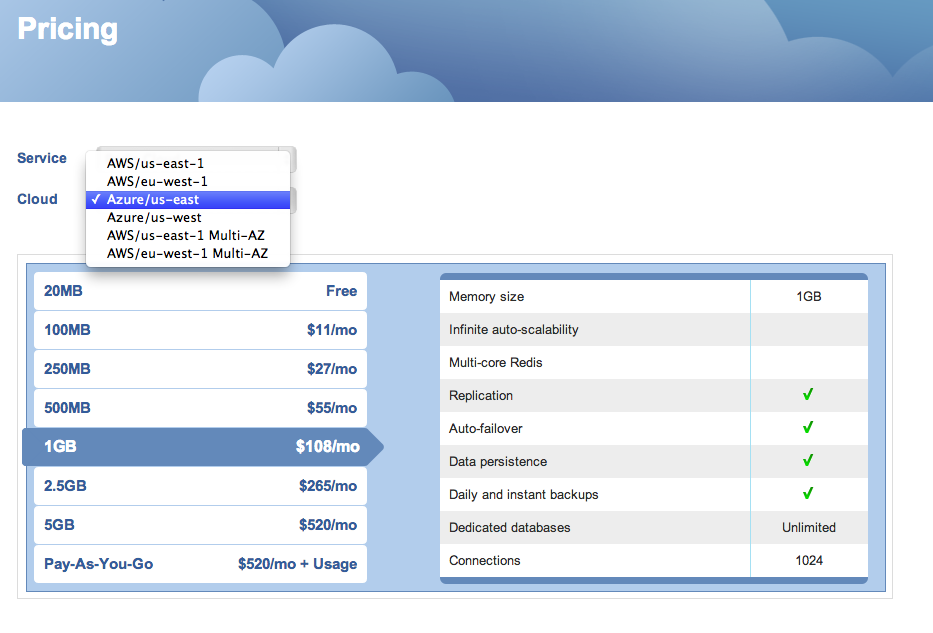

## Lab #2

In this lab, you'll become familiar with Redis, which is

>an open source, BSD licensed, advanced key-value store. It is often referred to as a data structure server since keys can contain strings, hashes, lists, sets and sorted sets.
>> [redis.io](http://redis.io/)

If you've ever worked with or are familiar with [Memcached](http://memcached.org/), then you'll quickly see the benefits of Redis as it is quite similar to Memcached in that all values are stored in memory. This makes data access _extremely_ fast. Where Redis is different is that the values of keys can be _more than_ just strings (as alluded to in the description of Redis!). Finally, Redis can persist its data to disk, supports master-slave relationships, and [clustering is due to come out soon](http://vimeo.com/63672368).

Redis makes a great solution for caching; however, it can also be used as a primary data store (provided your data can _fit_ into main memory). Because Redis allows you to store data structures, you can model out objects (via Hashes, usually), etc and there are a number of ORM-like libraries available to do just this. 

### Getting started with Redis

There's two options when getting started with Redis: you can download and install it (which is quite easy) or you can use an online interactive shell (that only supports _some_ of the standard features). If you are on an OSX machine, I would recommend installing Redis; plus, installing Redis will give you the the `redis-cli` shell command, which you'll want for interacting with cloud-based Redis instances. 

#### Installing Redis

Go to the [download section of the Redis website](http://redis.io/download), grab your platform's binary, unzip it, change directories into the root install directory and type:

```
$> make
```

Next, to start Redis, within the root directory of your Redis installation type:

```
$>  src/redis-server
```


Now Redis is up & running. 

#### Using the `redis-cli` shell

Now open up another terminal and change directories into where you installed Redis. Now type:

```
$> src/redis-cli
```

### Using the online shell (if you did not install Redis locally)

Go to [try.redis.io](http://try.redis.io/). Remember, this shell doesn't support _all_ the commands you can normally run in a local Redis shell; what's more, a few of the features we'll cover in this workshop *might* not be supported. 



#### Working with Redis

As Redis is a data structure server, there are a host of ways to store data -- you can store things as simple strings and associate them via a key. Or you can store lists, sets, and even hashes, just to name the most common ones. In this workshop, you'll see these basic data structures in action. 

If you don't have a terminal fired up and haven't already run `redis-cli`, please do so. Or you can go to [try.redis.io](http://try.redis.io/) as well. Either way, let's start simple. 

##### `GET` & `SET`

First type the following: 

```
set test "some value"
```

In this case, you've associated the string "some value" to the key `test` using the `set` command. Want to get the value for a simple string key? Watch:

```
get test
```

What do you see? 

`set` doesn't have to set a string value and keys can be any string you'd like. 

Redis is really good for real-time analytics because everything is stored in memory; plus, it works really well with numerical values. Watch:

```
set "60 Minute IPA" 1
```

What does the above command do? 

Now, I'd like to increment the integer value -- I could `set` 2 or I could:

```
incr "60 Minute IPA"
```

What's the value of  "60 Minute IPA" now? 

__Question__: How do you think you can decrement the value of "60 Minute IPA"?

Ponder this: why would you want to associate an integer with a string and then continually increment it or decrement it? What good does that do you? 

For more information on [Strings](http://redis.io/commands#string), see the Redis [documentation](http://redis.io/commands#string).

##### Lists

Keeping with the beer theme, I'd like to start to store the beers I'm drinking (from day to day, mind you). For example, I can keep a _list_ of beers I drank for a particular week and then I can find out what were the first three, etc. I can do this by using a Redis list. 

Run the following command:

```
lpush "recent::beers" "Guinness"
```

__Question__: What is the key in this case? 

`lpush` is a list command and it means push a value onto the list from the left -- i.e. put the value _on top_ like a stack. 

__Question__: How do you think you add a value to the _tail_ of a list? 

Let's add a few more: 

```
lpush "recent::beers" "60 Minute IPA"
```

and 

```
lpush "recent::beers" "Chimay Blue"
```

and 

```
lpush "recent::beers" "Fat Tire"
```

Lists support _ranges_ -- that is, you can select a subset of the elements in them. List indexes are 0 based. Thus, the item on top (i.e. the last item pushed via a `lpush`) is index 0. 

`lrange` means list range and takes a start value and end value. For example, if you wanted to get the first item from a list, you would pass in a 0 for the start value and a 0 for the end value. 

Thus, the _most recent beer_ can be obtained like so:

```
lrange "recent::beers" 0 0
```

__Question__: How would you obtain the first beer added (i.e. Guinness)?


__Question__: How would you get the most recent three beers I drank? 

__Question__: How would you get the first two?


For more information on [Lists](http://redis.io/commands#list), see the Redis [documentation](http://redis.io/commands#stringhttp://redis.io/commands#list).


##### Keys

By now, you've got at least two keys in Redis. You can always see your keys via the command: 

```
keys *
```

And you can see the  type of a key like so:

```
type key_name
```

Keys can have a TTL (time-to-live). Just set it via the `expire` command like so:

```
expire "recent::beers" 60 
```

`expire` takes an integer value representing seconds. After issuing the above command I can watch my key expire (i.e. disappear from Redis) by seeing the keys over time. 

```
keys *
1) "60 min IPA"
2) "recent::beers"
3) "test"
4) "favorite::beers"
5) "favorite_beers"
```

Wait about a minute and then:

```
keys *
1) "60 min IPA"
2) "test"
3) "favorite::beers"
4) "favorite_beers"
```

Notice one is missing? You can always obtain the TTL for a key via the `ttl` command.


For more information on [Keys](http://redis.io/commands#generic), see the Redis [documentation](http://redis.io/commands#generic).

##### Sets

A set is like a list, however, duplicates aren't allowed. If you add a duplicate value to a set, Redis will ignore you. Let me create a set of my favorite beers. 

```
 sadd "favorite::beers" "Delirium Tremens"
(integer) 1
 sadd "favorite::beers" "Delirium Tremens"
(integer) 0
```

See the second addition of Delirium Tremens? The return value of 0 means it wasn't added to the set. 

Let me add a few more: 

```
 sadd "favorite::beers" "Gouden Carolus"
 sadd "favorite::beers" "Sierra Nevada Pale Ale"
 sadd "favorite::beers" "Dead Guy Ale"
```

To see the members of the set, I can use the `smembers` command: 
```
 smembers "favorite::beers"
1) "Sierra Nevada Pale Ale"
2) "Gouden Carolus"
3) "Dead Guy Ale"
4) "Delirium Tremens"
```

You can apply set logic (union, diff, etc) to Redis sets. Redis sets support `sinter`, `sunion`, and `sdiff`, for example. To union two sets, you'd type:

```
sunion set_a set_b
```

Create a new set with the key "belgian::beers" and add the following items to it: 
  * Westmalle
  * Rodenbach
  * Delirium Tremens

__Question__: What is the result of `sdiff` between "belgian:beers" & "favorite::beers"? Now try switching the order of the two keys

__Question__: How many members are in the union of the two sets? 


For more information on [Sets](http://redis.io/commands#set), see the Redis [documentation](http://redis.io/commands#set).

##### Hashes

Another useful data structure that Redis supports is a hash. A hash is a key represented by a list of name-value pairs. Hashes are quite powerful structures in Redis and indeed, some ORM-like tools allow you model objects, such as `user`s and ultimately store them as hashes. 

For instance, I can create a hash representing my business card like so:

```
 hset "person::ajglover" "name" "Andrew Glover"
 hset "person::ajglover" "email" "ajglover@gmail.com"
 hset "person::ajglover" "twitter" "aglover"
 hset "person::ajglover" "linkedin" "http://www.linkedin.com/in/ajglover"
``` 

I can then access fields like so:

```
hget "person::ajglover" "email"
```

Which produces "ajglover@gmail.com". 

__Question__: How would you model a smart phone using Redis hashes?

Note: most Redis commands have a friendly cousin-command that can take multiple values; that is, `hset` has a corollary command dubbed `hmset`. `hmset` takes a series of name-value pairs. 

__Question__: Can you make the 4 command `hset` example above into one `hmset` command? 

__Question__: Why is something like `hmset` advantageous or the more prosaic `hset`? 

For more information on [Hashes](http://redis.io/commands#hash), see the Redis [documentation](http://redis.io/commands#hash).

#### That's not all!

Redis has a bunch of other structures and features; you've just scratched the surface here! I encourage you to take a look at the list of [commands](http://redis.io/commands), which is organized by data structure & feature. 

### Redis in the cloud

There are quite a few Redis-as-a-service options available to you. One of the earlier providers of Redis in the cloud is [RedisToGo](https://redistogo.com). Keep in mind that at this time, some providers are rather expensive (as compared to something like MongoHQ); nevertheless, they all provide free Redis options. 



I have a free account on RedisToGo and [Redis Cloud](http://redis-cloud.com/) -- you can connect to my Redis Cloud account using the `redis-cli` like so:

```
/src/redis-cli -h pub-redis-19515.us-east-1-3.1.ec2.garantiadata.com -p 19515 -a gomodev
```

__Question__: What is my _most recent_ 3 favorite beers? 




__Question__: Redis supports a master-slave relationship, where slaves replicate what a master has. Slaves can become a master with one command too. What are some strategies for building out a series of master-slave Redis servers using Redis Cloud that supports high availability and or disaster recovery? What are the costs? Hint: Redis Cloud offers different availability zones....


