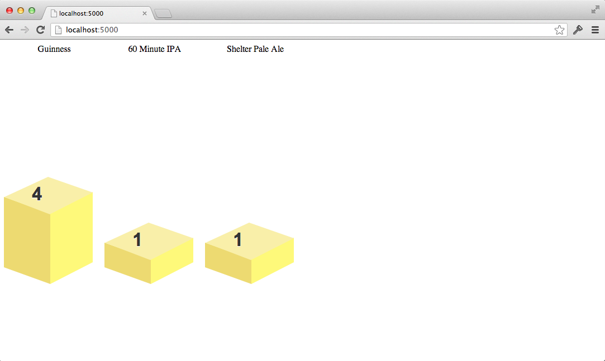

## Lab #3

In this lab, you're going to learn about Amazon's [DynamoDB](http://aws.amazon.com/dynamodb/). 

DynamoDB is part of the Amazon Web Services platform, which means you interact with Dynamo via HTTP requests -- bindings on top of Amazon's Web Service infrastructure make it possible to leverage Dynamo using the language of your choice. Under Dynamo's licensing, you pay only for the read and write throughput you consume. This is pretty slick -- you have the ability to set what's essentially an SLA for your data and you can increase or decrease the throughput as you see fit.

DynamoDB is a key-value store. It's

>a fully managed NoSQL database service that provides fast and predictable performance with seamless scalability.
>> [aws.amazon.com](http://aws.amazon.com/dynamodb/)

You can think of it as essentially a persistent map (or dictionary) -- that is, there is no schema; however, there are limited data types (strings and numbers). There are also no native joins between tables; you can, of course, manage relationships via application code (much like you can do in other non-join supported NoSQL databases, like MongoDB).

The beauty of DynamoDB, of course, is that it's always on and requires almost no maintenance -- _everything_ is handled by Amazon.

### The structure of DynamoDB

DynamoDB is logically defined as tables containing items. Items contain attributes. You can think of a DynamoDB table much like you would a table in the relational sense. Tables can have many items (which are similar to rows) and items can have 
many attributes (which are like columns in the relational world). Attributes are really just name-value pairs and the "pair" aspect isn't limited to one value. That is, an attribute name can have a list of associated values (this is slightly different than a typical column in an RDMBS, for example).

There isn't a shell-like application to work with Dynamo. You interact with Dynamo either through the Amazon Web Services (AWS) Management Console or via an API. AWS has a series of SDKs for various platforms (i.e. Java, Ruby, etc); furthermore, there are a host of open-source alternative APIs as well. 

Thus, to see how DynamoDB works, I'm going to show you an application that makes use of it. The application is a simple Node.js app that uses a nifty library for working with Dynamo; nevertheless, setup will take a few steps. Hang in there! 

Here we go...

### Installing Node.js

First and foremost, you'll need to install Node.js -- you can do this in [three steps](http://thediscoblog.com/blog/2013/03/12/node-in-3-commands/):

Step 1: Download and install nvm.

```
$> curl https://raw.github.com/creationix/nvm/master/install.sh | sh
```

Step 2: Reload your shell.

```
$> source .bash_profile
```

Step 2.5: Obtain a list of available node versions to install.

```
$> nvm ls-remote
```

Step 3: Install your desired version of node.

```
$> nvm install v0.10.0
```

### Foreman

Next, you'll want to install [Foreman](https://github.com/ddollar/foreman), which is a process runner (for lack of a better definition). Foreman makes running a series of processes easier by allowing you to define process requirements in one file, known as a `Profile`. 

You can install Foreman either as a [Ruby Gem](http://rubygems.org/) (so you'll need to [install Ruby](http://www.ruby-lang.org/en/)) or if you are on OSX, there is a .dmg installer. 

Finally, you'll need to install [CoffeeScript](http://coffeescript.org/).  Type:

```
$> sudo npm install -g coffee-script
```

The above command installs CoffeeScript as a global library -- this is needed for Foreman to run the `coffee` command.

#### Run the Brew Tally app

Now that you've installed all the infrastructure to run the sample DynamoDB app, you're ready to run it. This is simple (now). Make sure you open up a terminal and change directories into the `lab_3` root directory. Type:

```
$> npm install
```

which will install a few dependencies (namely dynode, which is that nifty Dynamo library I mentioned earlier) for the app. 

#### AWS credentials! 

Access to DynamoDB (and all other AWS products) is secured via an access key and secret. These are generated for an account, you can have more than one pair, and you can reset/re-generate them anytime (and in fact, you should reset them from time to time).

I've created a temporary access key and secret for this lab that grants permission to a DynamoDB instance. You will need to set these values in your environment for the simple app to work (as, naturally, the app communicates with a live instance of DynamoDB). 

To set these environment variables, type the following in a bash shell:

```
$> export ACCESSKEY=the_key_i_provide
$> export SECRETKEY=the_secret_i_provide
``` 

Note, I'll provide the two required keys at the time of the workshop (so don't literally put `the_key_i_provide`!).

#### Fire it up 

When that's complete, type:

```
$> foreman start
```

And then open up a browser and go to [localhost:5000](http://localhost:5000/). 



You should see a simple tally of votes for 3 beers. I've purposely kept this app simple as I want you to see the basics of working with Dynamo. Accordingly, using your favorite text editor, please open the file `DynamoDBTest.coffee` in the `test` directory.

### A DynamoDB API

Without going into too much detail of CoffeeScript or Node's syntax or even how to write tests in Node, let me show you a few things regarding Dynamo's API. And what better way to do so than via a test?

As I already mentioned, working with DynamoDB requires some credentials; you can see this in action via this line:

```
dynode.auth({ accessKeyId: process.env.ACCESSKEY, secretAccessKey: process.env.SECRETKEY })
```

You hopefully already set those two environment variables to even get this far, right?

#### Writes & Searches

The Dynode library makes it super easy to create DynamoDB items. Start by looking at line 16; the specification that is defined by ```describe 'updates for a beer using DynamoDB API'```. In the `before` clause note this logic:

```
update = {votes: {add : 1}, type: {put: 'IPA'}}
dynode.updateItem 'beer_ratings', '60 Minute IPA', update, (err, resp) ->
    done(err)
```

The variable `update` represents a map that contains two attributes: `votes` & `type`. Each attribute has a value preceded by an operation. In the case of `votes` the operation `add` means add 1 to what ever is there. For `type` the `put` operation writes a value for that attribute. In this case, the value becomes `IPA`. 

Next, the `updateItem` function writes the `update` map to the `beer_ratings` table for the item named '60 Minute IPA'. In this case, when I defined this Dynamo table, I specified that `name` was the primary key that I can thus search by. You'll see a search shortly. Also note, with Dynamo, you must define your primary keys upfront so as to facilitate efficient searching. As things are defined, for example, I cannot search a beer by its votes or type. Keep this in mind when you begin to define your tables and items!

You can see a DynamoDB search in the next clause of that specification. In ```it 'should support incrementing a value corresponding to a vote'```, you should see these lines of code:

```
dynode.getItem 'beer_ratings', '60 Minute IPA', (err, item, meta) ->
    item.should.have.property 'votes'
    item.votes.should.be.above 1
    done(err)
```

`getItem` is a search and it goes against a table (`beer_ratings`) and take a key: "60 Minute IPA". The value returned should, of course, have a property dubbed `votes` whose value is at least greater than 1 (because I added 1 in the setup code!).

__Question__: How would you add the vote for a different beer? For example, a vote for Guinness, which is a stout. Don't worry too much about the syntax of CoffeeScript if you are unfamiliar -- just make sure you get the idea using pseudo code if you'd like. 

__Question__: How would you find the votes for Guinness using the Dynode API?

__Ponder this__: Why did I make the name of the beer the key? What if I had made the _type_ a key? Or the _votes_? What would the ramifications be? Let's keep examining Dynamo's API as it might change your answer. 

#### Scans

As I pointed out, when you define a table in DynamoDB, you need to think upfront what the key of an item will be. That facilitates searching for items. In my case, the table 'beer_ratings' has a key dubbed name. Accordingly, I can efficiently search by a beer's name. But only ever by a name. 

Otherwise, I can _scan_ a table. Naturally, a table scan isn't all that efficient and if you have a lot of data, you'll be pulling down a lot of data (which you'll pay for depending on your throughput settings!). Nevertheless, if you take a look at the specification dubbed ```describe 'scanning for all beers'```, you'll see this:

```
dynode.scan 'beer_ratings', (err, items, meta) ->
```

And therein is a DynamoDB table scan. You pass in the table's name and you get back its contents. Thus, as 'beer_ratings' is currently defined, I can only get _all_ the beers from it or I can get an individual beer by its name. 

__Question__: How would you model a `user` table in DynamoDB? What would the primary key be? Attributes? 

__Question__: How would you store tweets in DynamoDB? Why?

#### How do I verify things?

By the way, you can run this test -- just type: 

```
$> cake test
```

Be sure to run this command _first_ before you change anything; provided it passes (it should!) then you can begin to make changes and see they work (by naturally running `cake test` again!).

### The surface is but scratched

This lab has given you a brief overview of Amazon's DynamoDB. But what you saw is the core of it. You can, of course, create tables programatically (and in this operation, you can define your key and throughput thresholds), delete items, and perform batch operations. 

If Node.js isn't your thing, I encourage you to check out one of the other myriad libraries available for Dynamo. While the API details and syntax might vary, the high level details will remain constant as any 3rd party API will ultimately map to AWS's core HTTP API. 
